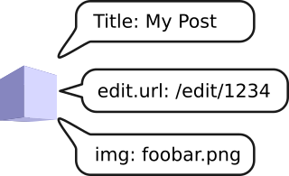

Description
===========

The description component allows you to obtain standardized values (e.g.
titles, links, descriptions) for object instances or class names.

Problem
-------

One problem that can present itself when developing a CMS system is
how to present information about objects in a standardized way. This may
happen when developing a content browser for example, or when rendering
breadcrumbs in an object hierarchy, where the objects may be of disparate
types.

One approach might be to implement interfaces (think ``HasTitleInterface``,
``HasThumbnailInterface``). But this forces the object to be modified, and
you will still need a service to resolve the value, or resort to a default if
none is set.

Solution
--------

The description component presents a framework in which the problem can be solved
effectively. It provides standard descriptors and a factory for
*descriptions*. Clients can then query the description to see if it has a
specific descriptor. It is your job to provide *enhancers* that will set the
*descriptors* on the *description*.

For example, a `Sonata Admin`_ enhancer
could use the metadata from the Sonata system to provide the *title* as Sonata
would present it, and provide links to the pages where the object can be
modified.

Workflow
--------

- Description is requested for a given object instance.
- Description factory creates a new description and passes it to description
  *enhancers*.
- Description enhancers add descriptors (e.g. title, edit URL, etc)
- User can retrieve descriptors for an object from the description.

Usage
-----

For example, if you have a ``App\Entity\Post`` entity and a
``App\Document\Page`` document, and you have created an enhancer
(``MyAdminEnhancer``) for your admin system and is aware of these two
objects.

.. code-block:: php

    <?php
 
    $post = // get the post entity
    $page = // get the page document
    $myAdminMetadataFactory = // your admin system has a metadata factory!

    $descriptionFactory = new DescriptionFactory([
        new MyAdminEnhancer($myAdminMetadataFactory);
    ]);

    $description = $descriptionFactory->getDescriptionFor($post);

    echo $description->get('std.title')->getValue(); 
    // "My Blog Post"

    echo get_class($description->get('std.title')) 
    // Psi\Component\Description\Descriptor\StringDesciptor

    $description = $descriptionFactory->getDescriptionFor($page);
    echo $description->get('std.title')->getValue(); 
    // e.g. "About Us"

The component includes a number of standard descriptors by default, including
a the (real) class FQN, URLs for viewing, updating or removing the instance,
URLs for thumbnail images, etc.

Subject Resolvers
-----------------

Sometimes an object may act as a proxy for another object (as is the case with
CMF/Puli resources for example). In these cases it is desirable to describe
the object that is proxied and not the proxy.

The description allows you to register "subject resolvers" which can "swap"
the subject before the description is made.

The resolver must accept a subject and return a subject:

.. code-block:: php

    class MySubjectResolver implements SubjectResolverInterface
    {
        public function resolve(Subject $subject): Subject
        {
            if ($subject->hasObject() && $subject->getClass()->isSubclassOf(MySpecialInterface::class)) {
                return Subject::createFromObject($subject->getObject()->getProxiedObject());
            }

            return $subject;
        }
    }

.. note::

    The subject ay not have an object, if you call the `$subject->getObject()` method
    you must ALWAYS first check that the subject has an object
    `$subject->hasObject()`.

You can then add it to the description factory using the second argument:

.. code-block:: php

    <?php

    use Psi\Component\Description\DescriptionFactory;
    use Psi\Component\Description\Schema\Schema;
    use Psi\Component\Description\Schema\StandardExtension;

    $descriptionFactory = new DescriptionFactory([
        new MyAdminEnhancer($myAdminMetadataFactory);
    ], [
        new MySubjectResolver(),
    ]);

Now whenever an object implementing ``MySpecialInterface`` is given to the
description the subject will be replaced.

Schema Validation
-----------------

In order that all systems use the `title` field in the same way, with the same
descriptor object, a schema system is provided.

This is a necessary evil, as if two enhancers use different descriptors for
the same purpose (e.g. ``title``, and ``name``) then the consumer can no longer
depend on a canonical way to retrieve the title.

When given to the factory the ``Schema`` ensures that only valid desciptor
names and value objects are set, and that when trying to retrieve an invalid
descriptor, useful exception messages are provided.

.. code-block:: php

    <?php

    use Psi\Component\Description\DescriptionFactory;
    use Psi\Component\Description\Schema\Schema;
    use Psi\Component\Description\Schema\StandardExtension;

    $schema = new Schema();
    $scehma->register(new StandardExtension());

    $descriptionFactory = new DescriptionFactory([
        new MyAdminEnhancer($myAdminMetadataFactory);
    ], [], $schema);

    $description = $descriptionFactory->getDescriptionFor($page);
    $description->get('invalid key'); // throws exception

.. note::

    Schema validation is an unnecessary (though negligble e.g. 40μs vs. 20μs)
    overhead in production and it can be disabled by simply not passing the
    schema to the factory.

.. _Sonata Admin: https://sonata-project.org/bundles/admin/3-x/doc/index.html
